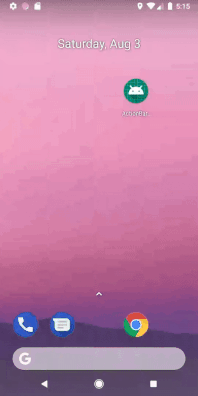

# Define the Options Menu using XML.



## Introduction

In this application we have created an options menu in action bar using xml file.

## Defining Options Menu using Xml

Right Click on res directory
> New
>> Android Resource File

Make sure you select Resource type as Menu.

We name it **menu_main.xml**.

In **menu_main.xml** :

```
<item
        android:id="@+id/action_menuOne"
        android:orderInCategory="101"
        android:title="@string/menuOne"
        app:showAsAction="never"
        />

    <item
        android:id="@+id/action_menuTwo"
        android:orderInCategory="102"
        android:title="@string/menuTwo"
        app:showAsAction="never"
        />

    <item
        android:id="@+id/action_menuThree"
        android:orderInCategory="103"
        android:title="@string/menuThree"
        app:showAsAction="never"
        />
```

We will load the menu at runtime using Java code.

Now, in **MainActivity** :

There's a callback method called ` public boolean onCreateOptionsMenu(Menu menu) { }`, to add menu items in action bar we will add this piece of code `getMenuInflater().inflate(R.menu.menu_main,menu);`

#### Working of menu items when clicked :

When the user selects an item from the options menu, the method `onOptionsItemSelected(MenuItem item) { }` will be called, and the menu item reference will be passed in.

Here we have done Toast on each menu item when clicked or we can also navigate to another activity if we want to.

This is a piece of code inside `onOptionsItemSelected(MenuItem item) { }`

```
int id = item.getItemId();

        switch (id) {
            case R.id.action_menuOne:
                Toast.makeText(getApplicationContext(), "Menu 1 Clicked", Toast.LENGTH_SHORT).show();
                break;

            case R.id.action_menuTwo:
                Toast.makeText(getApplicationContext(), "Menu 2 Clicked", Toast.LENGTH_SHORT).show();
                break;

            case R.id.action_menuThree:
                Toast.makeText(getApplicationContext(), "Menu 3 Clicked", Toast.LENGTH_SHORT).show();
                break;
                }
```                

# Thank you.
